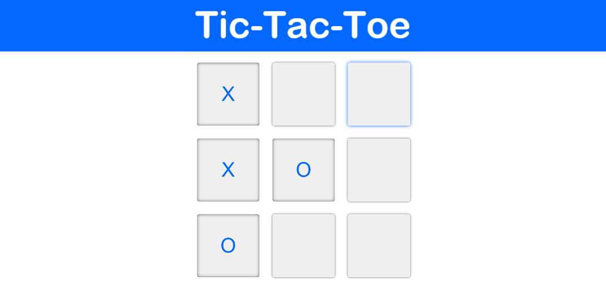

<!-- Page Title -->
<h1 align="center">Tic-Tac-Toe</h1>  

<!-- Title Image -->

  

<!-- Game Description -->

  <b>JavaScript Tic-Tac-Toe Game</b>

  This simple take on the classic game is powered by JavaScript and jQuery, and given a clean, responsive design with vanilla CSS.

<!-- Links - Trailer, Play Game, Sources -->

  <a href="https://twit96.github.io/tic-tac-toe/"><b>Click to Play Now!</b></a>

